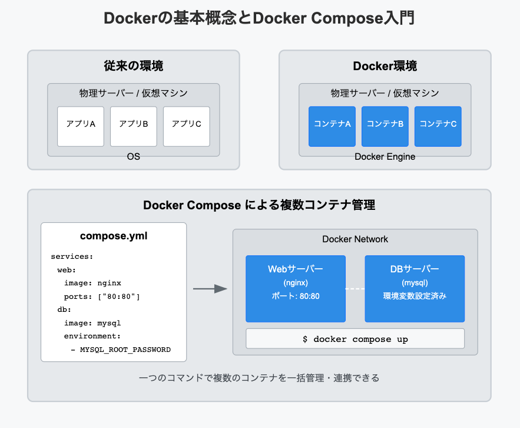

Docker Composeの基礎

【DockerComposeとは】  
DockerComposeとは、複数のDockerコンテナを定義、実行するためのツール。  
コンテナの定義や実行にはYAML形式のファイルの設定ファイルが必要。  
この設定ファイルをもとにコマンドを実行することで複数のコンテナを起動したり停止したりできる。いわば複数デバイスを一度に制御できるリモコン。  

【DockerComposeのメリット】  
・一括管理：複数コンテナを1つの設定ファイルで運用できる。  
・サービス連携：複数のコンテナが簡潔に連携できる  
・再現性：設定ファイルさえあれば誰でも同じように環境構築できる。

  
