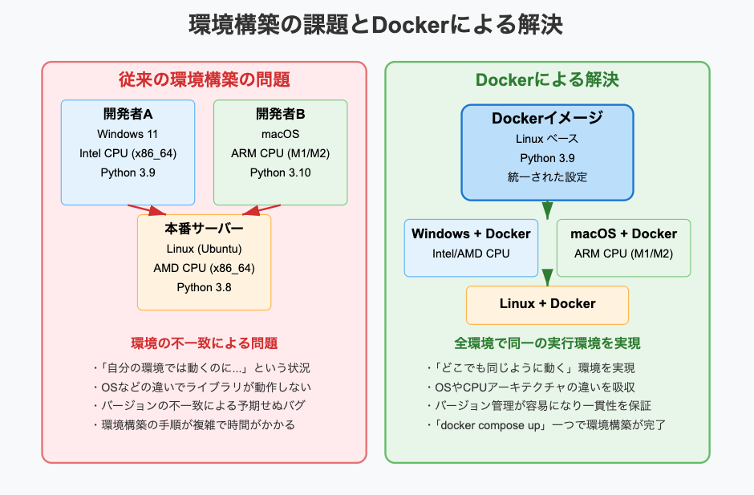
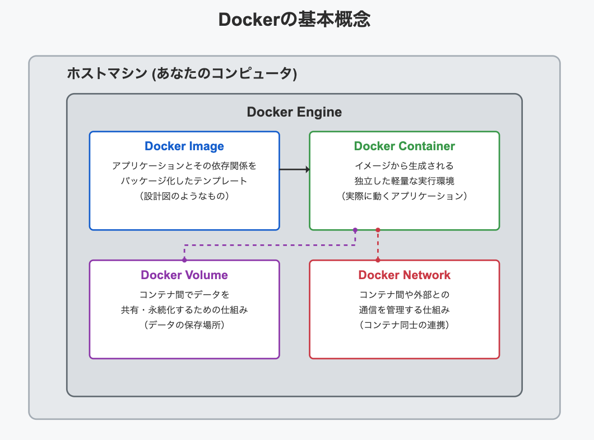

Dockerの利点

各開発者によって環境にはバラツキがあり、それらを一致させるのは手間になる。  
そこでDockerを使用する。Dockerにはコンテナというものが有り、そのコンテナにはすでにパッケージ化された設定やソフトが詰めれている。開発者はそれぞれの環境からそのコンテナを使用することで、それぞれが同じ環境で作業できる。  
イメージとしてはお弁当が近い。  
コンテナというお弁当箱には食材が詰められていて、  
みなが同じお弁当を受け取って同じものを食べる。
  
  

【Dockerの構成】  
Dockerは大きく四つで構成されている。  
①Docker Image：仮想環境やアプリケーションの設定などが入っている。Dockerfileという設計図から構築される。  
②Docker Container：Docker Imageから起動された実際の環境  
③Docker Volume：生成されたデータを保存しておく領域  
④Docker Network：コンテナ同士の連携を行う領域

  

補足）Dockerfileとは  
Dockerfileとは、Docker Containerの元になるDocker Imageを構築するための設計図。  
テキストファイルで記述しており、必要な依存関係や設定、実行すべきコマンドなどが順序立てて記述されている。  
主な命令  
FROM: 使用するベースイメージを指定する  
RUN: コンテナ内で実行するコマンドを指定する  
COPYやADD: ファイルやディレクトリをコンテナ内にコピーする  
CMDやENTRYPOINT: コンテナ起動時に実行するデフォルトのコマンドを指定する  