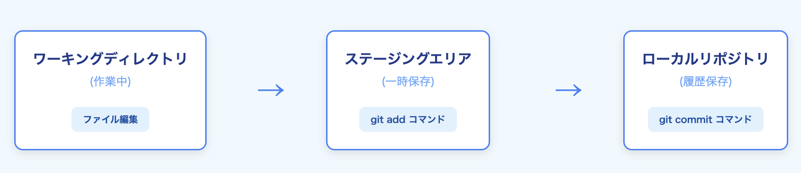
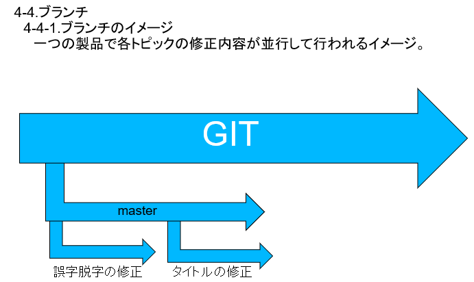
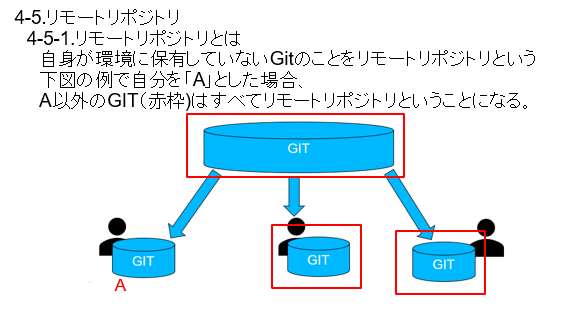
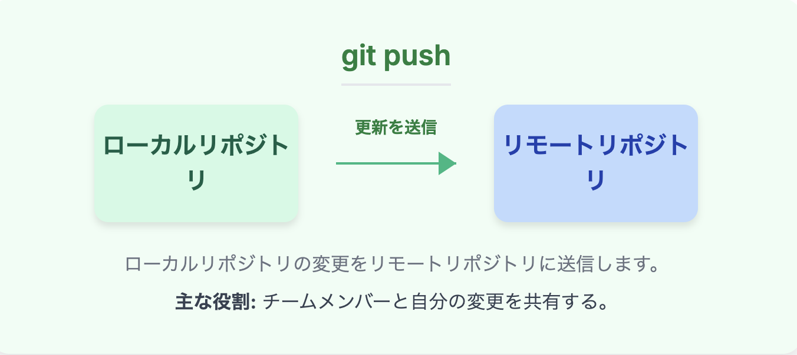
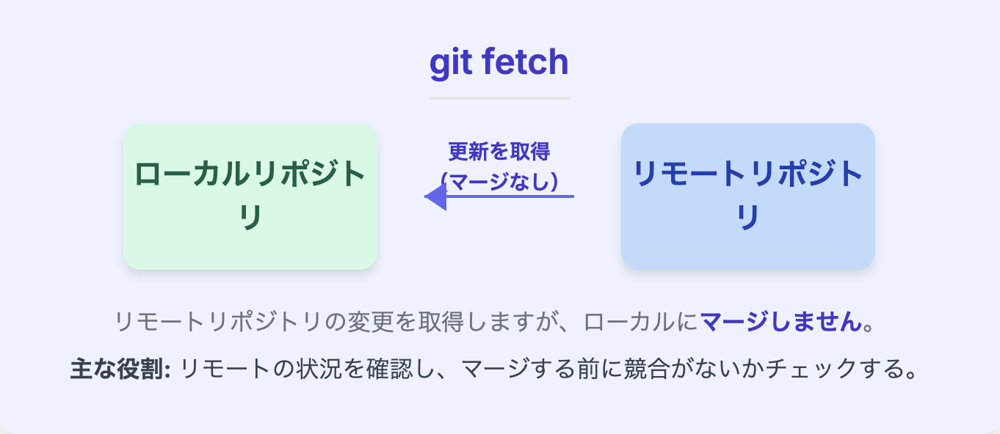

Gitとは

【Gitの概要】  
Gitは開発現場で使われる分散型のバージョン管理システム。  
分散型とは、分散型とは開発者それぞれが自分の環境にGitを所持して開発を行うこと。  
バージョン管理ではファイルの変更履歴を保存したり、過去の状態に戻したりが容易にできる。  
上記から以下のメリットがある。    
・履歴管理が容易になる  
・変更の追跡・復元が簡単になる  
・複数人での同時開発が効率よく行える

【Gitの3領域】  
  
①ワーキングディレクトリ：PC上で実際に作業している領域  
②ステージ領域：ワーキングディレクトリで変更した内容を一時的に保存する領域  
Gitでは丸ごとすべて保存するのではなく指定した行やファイルのみを上書きできる。その何を保存するかを選んで置いておく場所  
③ローカルリポジトリ：Gitの変更履歴を保存しておく場所。  
保存完了されているものが対象となっており、過去バージョンに飛んだりする。  

【Gitのコマンド紹介】  
●コミット(commit)  
コミットは変更履歴を記録する操作。  
いつ、だれがどのような変更をしたかが記録され、  
過去コミットを辿って過去の状態に戻ったりできる。  
●ブランチ(branch)  
ブランチはGitの中で独立した作業領域を作るための仕組み  
メインから作業ごとにブランチを作成して最終的に統合するような運用をする。  
  
●マージ(merge)  
異なるブランチを統合する操作。  
補足）コンフリクト  
マージした際に同じ場所を別の作業者が変更していた場合、  
自分と別作業者の間で修正箇所が衝突してしまう。  
どちらの変更を優先させるかなどを手動で決定し解消される必要がある。  

【Githubとリモートリポジトリ】  
GitHubとは、Gitを使用しているプロジェクトをインターネット上に公開し、他作業者とともに作業するためのサービス。  
公開されるGitはリモートリポジトリと呼ばれる。
リモートリポジトリとは、GitHubなどのオンライン上にあるリポジトリのこと。  
このリモートリポジトリに後述するpullやpush,fetchを行い変更を共有する。  
  

●push：変更内容をリモートリポジトリに送信する。  

●pull:リモートリポジトリの変更内容を自分の環境に反映させる。  
  
●fetch：同じく、リモートリポジトリの変更内容を取得する。  
取得するだけで変更内容をマージさせず、衝突がおきないかチェックする。  

