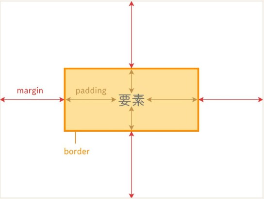

#CSSの基礎

・CSSは見た目を制御するためのもので、HTMLなどで構造を定義した要素に色やフォント、スペースなどのスタイルを指定できる。CSSはWebぺージを一貫して適用できるので、ページを跨いでもデザインを継承できる  
・CSSの構成  
　CSSは、「セレクタ」と「プロパティ」を組み合わせて構成されている。言葉は横文字でむずかしいが、セレクタとは要素で、その要素に対してのデザインをプロパティと呼称している。  
 セレクタ：画面内の要素（HTMLでタグ付けしたもの）後述のIDとクラスを参照  
 プロパティ：要素に対するデザイン（カラーや配置、大きさなど）  
 ・CSSの書き方  
 CSSの呼び出し方法にはいくつか方法がある  
 ①HTMLの要素を記載する際に一緒にCSSも記載してしまう。（インラインスタイル）  
 ```　<p style="color: blue; font-size: 20px;">このテキストは青色で20pxです。</p>```  
 ②HTMLのhead部分に予め記述しておく（内部スタイルシート）  
 ③別でCSSファイルを記載しておき、HTMLではそのファイルを読み込む（外部スタイルシート）最も推奨される方法  
 ④③のCSSファイル内で他のCSSファイルもインポートする。  
  →①では要素ごとにプロパティを変更できる  
  →①以外は予めプロパティを設定できるので同じタグを持つ要素すべてにプロパティを適用できる。

・よく使うプロパティ：Webページを検証で開いてみたり外部サイトをみること  
 color：テキストの色を指定する  
 width：要素の幅を指定  
 height：要素の高さを指定  
 position：要素の配置方法を指定(relative,absolute,fixed)  
 display：要素の表示形式を指定(block,inline,none)  
 margin-padding-border要素の余白などを指定する画像を参照。
　

・IDとクラスの使い分け  
CSSで要素を指定する方法は大きく二つある  
①ID(#)HTMLでIDを設定しておき、そのIDに対してCSSを記述する。  
例文）  
```<div id="header">ヘッダーコンテンツ</div>```  
```#header {color: white;}```  
②クラス(.)クラスも同様にHTMLで指定したクラスをCSSで記述する  
例文）  
```<div class="content">contentクラスを適用</div>```  
```<p class="content">こちらもcontentクラスを適用</p>```  
```.content {color: gray;}```  

【使い分け】  
IDは文書ないで一度しか使用しないため、たった一つの要素に対してプロパティを指定する際に用いる。  
クラスは複数の要素に対して使用できるので共通のスタイルを適用したいときに使用する。  
なお、同じ要素にIDとクラスを両方しようした場合はIDが優先される。  

【CSSセレクタ】  
上記の例文のように#や.で要素を指定するパターンをセレクタと呼ぶ。  
ID、クラスは割愛。  
・タグセレクタ：HTMLのタグ名を直接指定してタグをもつすべての要素にプロパティを設定する  
　例文）```p {color: blue;}```  
・子孫セレクタ：タグ内の中のすべての階層に位置する要素に設定。  
　例文）```div p {color: green;}```　divタグ内のpタグ全て  
・子セレクタ(>)：タグ内の直近の階層内のタグ一つを指定  
　例文）```div > p {color: red;}```　divタグ内の直近のpタグ  
・属性セレクタ([])：特定の属性（テキストや図形）を持つ要素を選択  
　例文）```input[type="text"] {border: 1px solid black;}```テキストのもの共通の設定  
・疑似クラス(:)：ある状態の要素を指定できる  
　例文）```a:hover {color: orange;}```マウスカーソルが乗ったaタグの要素  
・疑似要素(::)：ある特定の部分を指定  
　例文）```p::first-line {font-weight: bold;}```　pタグ内の1行目  
・セレクタを連結させて条件を指定  
　例文）```div.example#unique {background-color: yellow;}```  
　div「タグ」内の、example「クラス」、かつ「ID」がuniqueのもの。