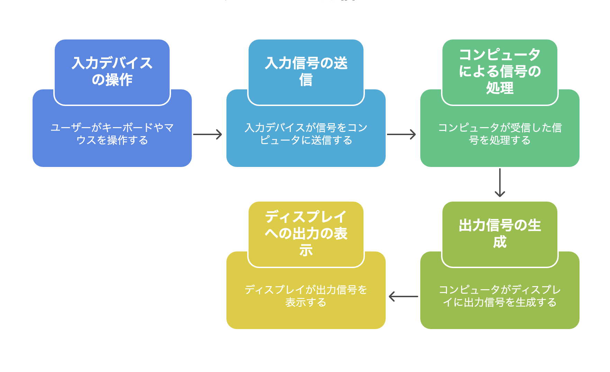

インターフェースについて

インターフェースとは、コンピュータや周辺機器、ソフトウエア間で情報をやりとりする仕組みのこと。  
たとえばキーボードやマウス操作がディスプレイに伝わり反応することもインターフェースの一つ。  
  

【インターフェースの種類】  
・ユーザー向けのインターフェース  
　①GUI（グラフィカルユーザーインターフェース）視覚的に理解しやすい操作  
　　マウスでのクリック、ドラッグ操作  
　　タッチスクリーンでのタップ、スワイプ操作  
　　キーボードでのショートカットキー操作  
　　ボタンやメニューからの選択操作  
　②CLI（コマンドラインインターフェース）コマンド入力して行う操作  
　　キーボードでのコマンド入力（例：ls, cd, mkdirなど）  
　　パラメータやオプションの指定（例：ls -la, grep -r "text"など）  
　　パイプ処理での複数コマンド連携（例：cat file.txt | grep "word"）  
　　スクリプトファイルでの自動化処理  
・プログラム同士のインターフェース
　API（アプリケーションプログラミングインターフェース）  
　APIは、異なるプログラムやソフトウェアが情報を交換するための取り決め。  
　この取り決めにより、各プログラムはそれぞれ独立して作られていても、ルールに沿ってデータのやりとりが可能。  

【入出力】  
　入力デバイス: ユーザーの操作や外部からの信号をコンピュータに取り込む  
　出力デバイス: 処理結果を人間が理解できる形で表示する  
　記憶装置: データの保存と取り出しを行う  
　通信装置: ネットワークを通じた外部とのデータ交換を行う