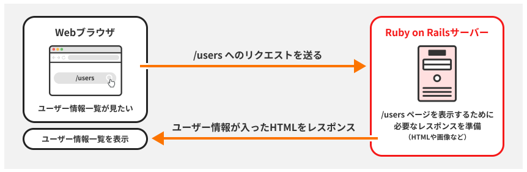
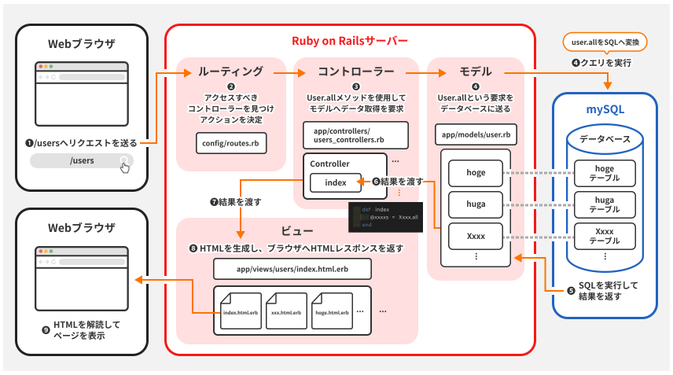
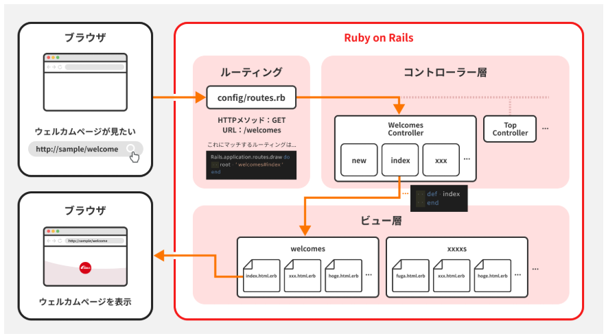
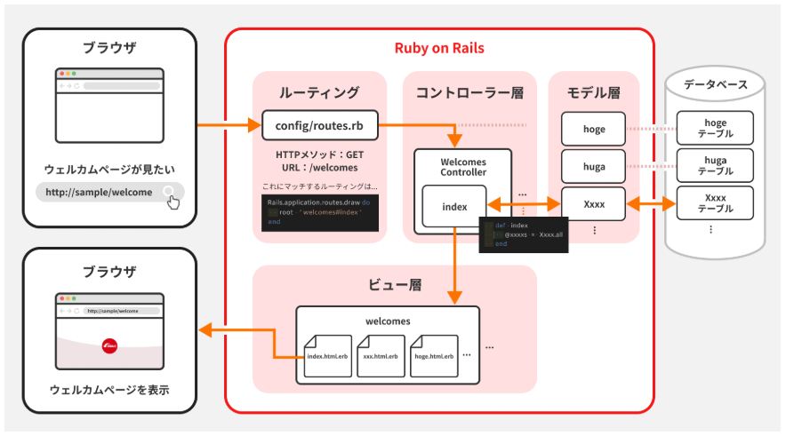
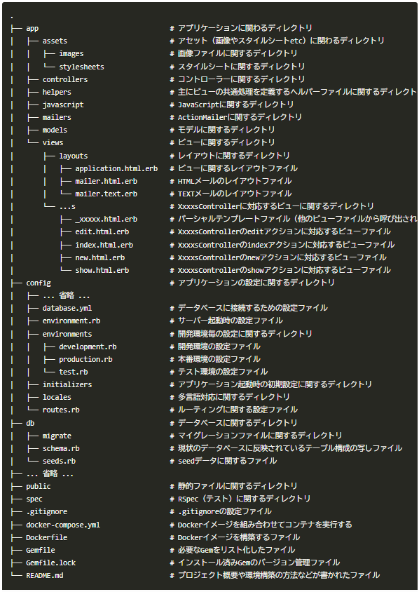

Rails基礎

【Railsとは】  
MVCアーキテクチャを採用したWebアプリフレームワークのこと。  
※アーキテクチャとは、システムの設計や構成のこと  

【MVCアーキテクチャ】  
MVCとはアプリケーションのコードを以下の三つに分ける設計手法のこと  
●Model（モデル）  
データやビジネスロジックを扱う部分。DBと連携しデータの保存、取得、更新を行う。  
●View（ビュー）  
ユーザーに表示する部分。HTML/CSS、JSなどで見た目を定義する。  
●Controller（コントローラー）  
ModelとViewの橋渡し。ユーザーからのリクエストをModeklを操作して、結果をViewに送る。  
コントローラー名は英語の複数形を使うことが推奨される。   

【Railsでの処理フロー】  
Railsでの処理の流れは以下のようになっている。
  
  

【DB操作がない場合のRaisでの処理】  
  
  
[共通処理]  
ルーティング：ルーティングの設定ファイルにはURLに応じて適切なコントローラーを呼び出すよう設定されているため、リクエストに応じたコントローラーを呼び出す。  
[DBなし]  
コントローラー：ページを表示する準備を行う。  
[DBあり]  
コントローラー：モデルへDBの操作の指示をだす。 
モデル：DBへアクセスしてSQLを実行。必要データを取得。結果をコントローラーに返す。  
[共通処理]  
ビュー：HTMLを生成し、ブラウザに返す。 

【ディレクトリ構造】  
gitでcloneしてきた時点では下記のような構造になっている。  
基本構造なのでそれぞれ確認すること。  
  

【MVCモデルの導入】  
scffoldコマンドというものがあり、  
これを実行すると、MVCモデルに必要なリソースを全て生成できる。  
しかし、プロジェクトの要件と一致しない場合が多かったり、  
柔軟にカスタマイズしづらいという点から実務ではあまり使用されない。  
このような場合から開発者は必要な機能だけを手動で実装したりする。  

【DB操作】  
db:migrateコマンドを使用して、マイグレーションを実行する。  
マイグレーションとは、簡潔に言うとDBを安全に更新、移行する仕組みのこと。  
マイグレーションファイルという指示書に従って自動で行う。  
コマンドを実行すると以下の処理が行われる。  
・未実行のマイグレーションファイルを順番に実行する  
　上の順番というのは日付（タイムスタンプ）をもとにしている。  
・実行後にDBの構造（スキーマ）を最新のものへ更新する  

補足）scaffoldのあるある不具合  
scaffoldをマイグレーション前に実行すると、マイグレーションできていないファイルがあるというエラーが発生する。  
その結果エラー以下の部分のリソースが生成できなくなる。  
対策はエラーになった際、マイグレーションを実行して、  
もう一度scaffoldを実行。  
この際、おなじコマンドをそのまま実行すると重複して、生成してしまう資源ができてしまう。  
そのためすでにあるファイルはスキップする--skipを足して実行する。