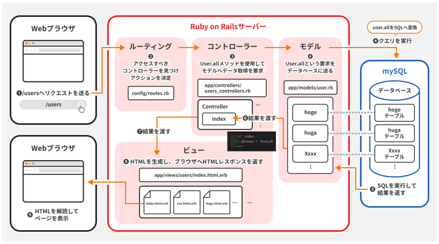

Railsにおけるセッションとルーティング

【セッションについて】  
(WebのHTTPとは.mdにも記載)  
セッションはサーバー側で保持されるユーザーの情報のことで、  
ユーザーが再訪した際にサービスを利用しやすくするもの。  
※Railsでは上記は異なる詳細は後述する【セッションストア】を確認   
・RailsではユーザーごとにセッションIDが生成される。  
・セッションIDはCookieとしてブラウザに保存され、キーと値のペアで情報を格納できる。  
・セッションデータはハッシュ形式で保存され、同じくキーと値のペアで情報を格納している。  

【セッションヘルパーメソッド】  
セッションを簡単に扱えるようにするメソッド  
例）  
sessionメソッド：指定したキーに関連付けられた値を取得できる  
`session[:user_id]`  
上記はuser_idに関連付けられてた値を取得している。
補足）sessionは値の取得以外にも保存や更新もできる。  
# 保存・設定  
session[:user_id] = 15  
# 取得  
user_id = session[:user_id]  
# 削除  
session.delete(:user_id)  

【セッションストア】  
通常のサーバークライアントモデルであれば、  
セッションストア情報はサーバー側で保持し、Cookieについてはクライアント側で保存するようになっている。  
しかし、Railsは特殊で、Cookieにセッション情報を一体化させ、  
セッション情報も併せてクライアント側で保持させる。  
このようにセッション情報をCookieとともにクライアント側で保存させることをCookieStoreという。  
セッションストアとはセッションをどこにどう保存するかを指定する仕組みのようなもの。  
今回はCookieに保存させるのでCookieStoreというセッションストアを使用。  
セッションをDBに保存させるのであればDbStoreというセッションストアを使用することになる。  

【ルーティング】  
ルーティングはクライアント側からリクエストを受け取り、どのコントローラアクションを実行するか決める。  
  
定義はconfig/routes.rbファイルで行う。  
ルーティングにはHTTPメソッド（GET,POST,PUT,など）,URLパターン、コントローラ名、アクション名を指定できる。  
これによりリクエストの形式に対して、どのコントローラでどのようなアクションを実行させるかをあらかじめ定義できる。  
例）  
`get '/articles', to: 'articles#index'`  
GETをartickeに送信するとArticlesContorollerのindexアクションが呼び出される。  
つまり、MVCモデルにおけるリクエストをコントローラに橋渡しする役目である。  

【resourcesとresource】  
[resources]
上記のようにリクエスト種ごとに一つずつ記述するには、非効率なので、よく使われるルーティングをまとめて自動的に定義できる。  
例えばresources :postsと記述するだけでpostでのリクエストに対する作成・詳細・編集などのルーティングをすべて定義できる。  
[resource]  
1つしか存在しないリソース（位置情報やユーザー設定）を扱う場合に使用する。  
resource :geocorder(位置情報)と入力すると作成・詳細・編集などのルーティングを設定できる。  
[差異]  
リソースが複数あるか一つしかないかを考える。  
商品や投稿は複数存在するが、位置情報やその人個人のプロフィールは一つしかない。  
補足）  
ルーティングにonly:%i[アクション]と記述すると、  
指定したアクション以外の機能を生成されないように設定できる。  
newとcreateと記述した場合editやdestoroyは生成されない。  

