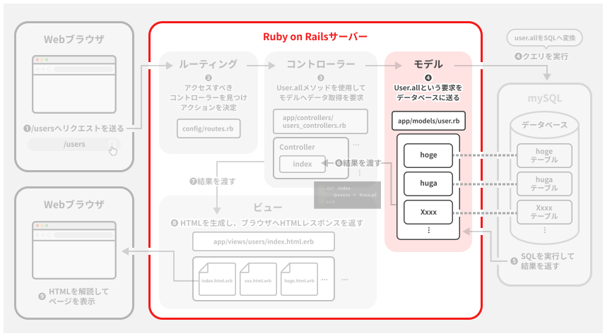

モデルについて深堀

【前提】  
モデルはMVCモデルにおけるMである。  
役割についての復習。  
DBへのアクセスや、ロジック処理を行う部分。  
  
【ActiveRecordについて】  
ActiveRecordはRailsに備わっているORMライブラリの一つ。  
これにより、Rubyのようなオブジェクト指向プログラミング言語とモデルを紐づけてDB操作を簡単にしてくれる。  
(わかりやすく言うとRubyの文でSQLを実行できる。詳細はWebの『ORMとActiveRecord』を参照)  
