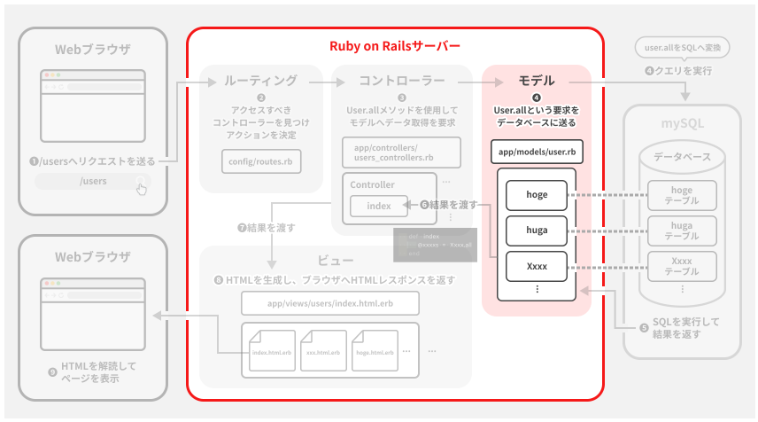

モデルについて深堀

【前提】  
モデルはMVCモデルにおけるMである。  
役割についての復習。  
DBへのアクセスや、ロジック処理を行う部分。  
  
【ActiveRecordについて】  
ActiveRecordはRailsに備わっているORMライブラリの一つ。  
これにより、Rubyのようなオブジェクト指向プログラミング言語とモデルを紐づけてDB操作を簡単にしてくれる。  
(わかりやすく言うとRubyの文でSQLを実行できる。詳細はWebの『ORMとActiveRecord』を参照)  


【アソシエーション】  
異なるモデル同士の関連付けを表現する機能  
モデル同士がどのような関係であるかを考える。  
基本的には1対1、1対多、多対多の関係がある。  
これらはそれぞれの立場で相手がどういう立場になるかを考えるとわかりやすい。  
例えばユーザーと投稿記事の関係だと、  
ユーザーから見ると記事はたくさんあるので1対多になる。  
記事からみるとユーザーは一人なので多対1の関係であるといえる。  
参考記事(https://qiita.com/tanariho/items/0807b1e24e297dc21534)  

アソシエーションのメリット  
関連データの取得が簡単になる。  
```  
article = Article.find(1)
comments = article.comments  # 一対多の関連データを取得  
```  
上記の例文ではArticleというモデルとcommentsというのが関連付けられており、   
記事に対してコメントが1対多の関係であり、 親の記事からコメントを抽出している処理である。  

【アソシエーションの種類】  
・belongs_to：親に対して自身が子である場合に使用。子側に外部キーを設置する必要がある。  
・has_one：子に対して自身が親である場合に使用。  
・has_many：複数の子に対しての親である場合に使用。  
・has_many :through：中間モデルを介して多対多の場合に使用。  
・has_one :through　：中間モデルを介して1対1の場合に使用。  
・has_and_belongs_to_many：中間モデルなしで、多対多の場合に使用。  
