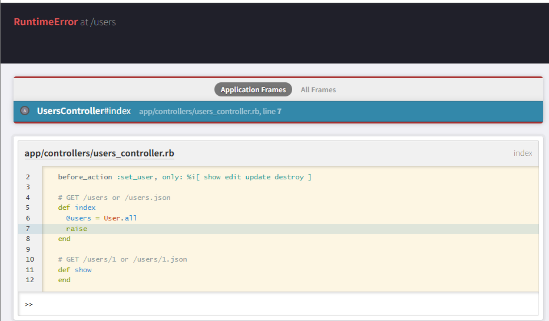

デバック  

【Gem】  
RubyにはGemといわれるパッケージソフトが備わっている。  
GemにはRubyの拡張機能やライブラリがまとめられている。  
リポジトリからGemをダウンロード・インストールして機能を使用できる。  
Gemの一覧やバージョンを定義するファイルが「Gemfile」  
このGemfileをもとにGemをインストール・管理するのがBundler  

【Bundler】  
Bundler（バンドラー）RailsやGemなどのRubyベースで作成されたアプリのバージョン管理や依存関係の解決を行うツール  

【Railsコンソール】  
アプリを対話的に操作できるツール  
以下のような操作ができる。  
モデルのインスタンスを作成・保存・取得  
データベースの中身を直接確認・変更  
コードやメソッドの挙動を試す  
エラー発生時に変数やメソッドの状態を確認して原因を探る  
コンソール立ち上げコマンド↓  
`docker compose exec web rails console`

【raiseとbetter_error】  
プログラムの途中で「raise」を入れることで意図的にエラーを発生させることができる。  
エラーがある状態でWebにアクセスするとエラー画面が表示される。  
このエラー画面はbetter_errorsと呼ばれ、コンソールのようにRubyの入力を受け付ける。  
  

【gem'pry-byebug'】  
gem 'pry-byebug'はPryとByebugという2つのデバッグツールを統合するためのライブラリ。  
主な機能は以下  
ステップ実行：コードを1行ずつ実行しながら、処理の流れを確認できる  
ブレークポイント：任意の場所に binding.pry を書くことで、そこで実行を一時停止  
インタラクティブシェル：停止中に変数の中身を確認・その場でコード実行が可能  
