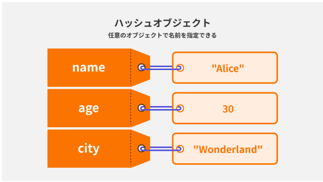
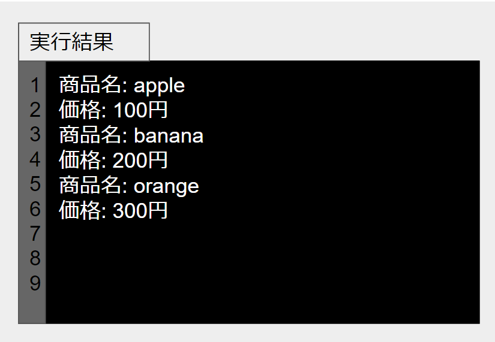

ハッシュとは

PHPの連想配列とまったく同じ概念。
ハッシュとは端的に言うと、配列にキーを割り振り、要素をラベリングするイメージ。  
ハッシュは{}を使用して定義する。  

例）  
["りんご","みかん","バナナ"]という配列に対して、  
[{apple:"りんご",orange:"みかん",banana:"バナナ"}]のようにハッシュでラベリングすると、appleと入力すると"りんご"を呼び出すことができる。  
なぜハッシュを使うのか。  
大量のデータの中からキーだけでデータを探索できる。  
要素番号に頼らず、キーで値を見つけることができる。 

【ハッシュから値を取得する】  
hash名[:キー]でキーを持つハッシュ内の値を指定できる。  
例文）  
fruites = {name:"apple"}  
puts fruites[:name]  

【ハッシュの連結】  
mergeメソッドを使用して、複数のハッシュを結合する。 
同じキーを持っているものをマージすると引数で渡したhashの方が優先される。   
例文）  
```  
hash1 = {name:"Alice",age:"30}
hash2 = {city:"Wonderland"}
hash3 = {name:"Bob"}

new_hash = hash1.merge(hash2)
Bob_hash = hash1.merge(hash3)
```  
[hash内の結果]
{:name=>"Alice", :age=>30, :city=>"Wonderland"}
{:name=>"Bob", :age=>30}同じキーを持つBobに上書きされる。  

【hashに対する繰り返し】  
PHPでいうところのforeach構文  
Rubyではeach doを使用する。  
例文）  
```  
hash = {name:"Alice", age:30, city:"Wonderland"}

hash.each do |key,value|
  puts "#{key}: #{value}"
end
```  
each内で引数を指定する。  
eachはハッシュ内のすべての要素にdoの処理を行わせる。  
| |内のkeyとvalueは変数名なので好きな文言で可。  


【ハッシュと配列の二重配列】  
配列内にハッシュを組み込み二重配列にする。
例文）ハッシュの中身を表示するプログラム    
```  
def cashier(items)
  sum = 0
  items.each do |item|
    puts "商品名: #{item[:name]}"
    puts "価格: #{item[:price]}"
  end
end

items = [{ name: "apple", price: 100 }, { name: "banana", price: 200 }, { name: "orange", price: 300 }]
cashier(items)  
```  
解釈）  
putsでitemの:nameというキーと、itemの:priceというキーを指定して、  
文字列化したうえで出力している。  
ハッシュの値を取り出す際は、ハッシュ名[:キー]で値を指定できる。  
出力結果）  


補足）「p」メソッドとvar_dump関数  
Rubyにおける「p」メソッドはデータ型や構造を出力してくれる。  
PHPにおいてのvar_dump関数と同じもの。  
補足2）  
ハッシュのキーと値の関係は「:」ではなくPHPと同じく「=>」でも紐づけられる。  
{name: "apple"}と{name: => "apple"}は同じです。