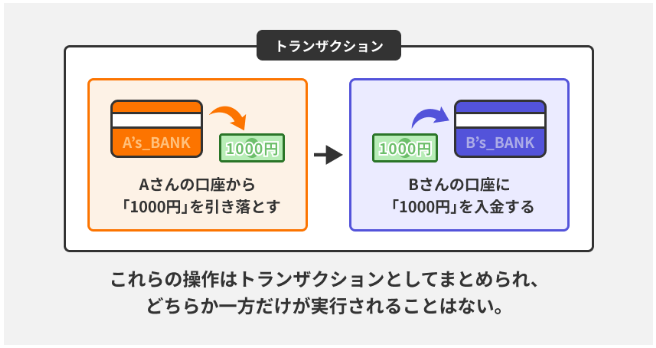
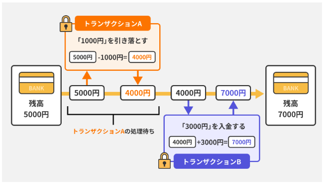

DB運用と管理  

DB運用と管理には以下4つの概念が重要。  
●トランザクション管理  
●ロック機構  
●ユーザー管理とセキュリティ  
●インデックス設計  

【トランザクション管理】  
トランザクションとはDBに対する操作をひとまとまりにしたもの。  
トランザクションは操作がすべて完了の成功か、操作が何も実行されていないの  
常に2択だけにする。  
上記のトランザクションの特性をACID特性という。  
[ACID特性]  
Atomicity(原子性)：トランザクションの操作が完了するか否かを保証する  
Consistency(一貫性)：トランザクション終了後もDBの一貫性が保たれる  
Lsolation(独立性)：トランザクションは他のトランザクションから独立している。  
Durability(永続性)：トランザクションが成功するとその結果は永続的に保存される。  
  
上記は銀行口座振り込みの例。  
[コミットとロールバック]  
コミットはトランザクションの処理がすべて正常に完了したことをDBに通知する操作。コミットされると、DBの変更内容が確定し、内容が保存され他ユーザーからも確認できるようになる。  
ロールバックトランザクション中に問題が発生した場合、
すべての操作を取り消す。  
DBの状態もトランザクション開始前に戻る。  

【ロック機構】  
ロックはデータへの同時アクセスを制御する仕組み。  
主に排他ロックと共有ロックがある。  
排他ロック：データの読み取り、書き込み両方を制限する。  
共有ロック：データの読み取りは許可、書き込みは制限する。  
下記の例では一つのトランザクションが完了するまで、ロックをかけ、別のトランザクションが実行されないようにしている。  
  

【ユーザー管理とセキュリティ】  
ユーザーごとにアクセス権限を持たせる。  
例）一般ユーザーは読み取りのみ可能、管理者は書き換えも可能など  
DBのアクセスをSSL/TLSで暗号化するなどの対策も効果的。  

【インデックス設計】  
インデックスとはDB内のデータに高速アクセスするための仕組み。  
基本的に検索などでよく使うカラムに対して設定するもの  
SQL文内でINDEXと指定するがDB側で自動で使用するINDEXを割り振ってくれる。  
商品検索などするときに結果がユーザーに早く返ってくる。  
[インデックスの種類]  
●B-treeインデックス：範囲検索や等価検索に適している。  
●ハッシュインデックス：ハッシュ関数を使用してデータを格納するインデックスで等価検索に特化している  
●全文検索インデックス：テキストデータに対する全文検索を効率化させる。大量のテキスト内から特定の単語を調べる際などに使用。  
(等価検索：特定の値の検索)  
注意点：インデックスを設けすぎるとデータ容量を圧迫する。  
またインデックスはデータが変更されるとインデックス側も更新する必要がある。  
