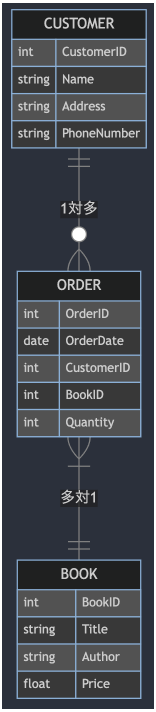

DB設計とER図

【DB設計の重要性】  
ビジネスの要件をデータモデルに落とし込むためにDB設計が必要。  
データ項目の洗い出しやエンティティとリレーションの定義、正規化が含まれる。  

【ER(エンティティリレーション)図】  
ER図はDB設計で視覚的にDB構成と関係を表す図。  
[要素]  
●エンティティ(実体)：システム内の重要なオブジェクトを表し、それぞれが属性を持つ  
●属性：エンティティに関連するデータ項目を表す  
●リレーション：エンティティ間の関係性を示し、ビジネスルールを反映する。  

ER図の例  
顧客、書籍、注文というエンティティがあるとした場合の例  
  
1.各エンティティにはそれぞれが持つ属性が記述されている。  
2.エンティティ同士のリレーション(関係を見る。)  
→1顧客は複数注文ができるので注文エンティティとは1対多の関係。  
→複数ある注文内では書籍を複数含めることができる多対多の関係(画像例は多対1になっている)  

【データ項目の洗い出し」  
1.まずどのような機能をもつシステムを提供するのかを明確にする。  
例）顧客が書籍を検索閲覧、購入する。書籍の在庫管理、注文履歴の管理、顧客情報の管理など  
2.上記の機能によって必要なデータ項目をリストアップする。  
3.さらにデータ項目を細分化し、それぞれ何型の値なのかや、ユニーク制約を設けるかなど特性を定義する  

【正規化】  
DB内のデータの冗長化を排除して矛盾や重複を防ぐ。  
正規化はデータを何段階も正規形に変換させる。  
●第一正規形（1NF）では各フィールドに単一の値が入っているかを確かめる。フィールド内に値が二つはいいている場合はNG  
●第二正規形（2NF）では"部分的関数従属"がないことを確かめる。  
部分的関数従属とは、キーに対してそれに付随したカラムがないかということ。  
例えば注文テーブル内にBookID(キー)とBookTitleがあった場合、  
BookIDとTitleは従属関係にあるので、注文テーブルからは別テーブルとして切り出さなければいけない。  
●第三正規形（3NF）では"推移的関数従属"がないか確かめる。  
"推移的関数従属"一つのキーから連鎖的に値を割り出せるようになっていないかということ。  
例えば特定のキーであるIDから、レコードを一つ割り出し、そのレコード内の値から部署IDを割り出し、その部署名から部署名を割り出す。  
のようにキーから連続して結果的に一つの値を絞り出す。  
もし部署名を変更したいときに、全レコードで同じ部署名のものはすべて変更しなければいけないが、別の部署テーブルとして切り出しておくとわかりやすい。  
つまり「Aから直接Cが決まる」のではなく、「AからBが決まり、BからCが決まる」ということ  
