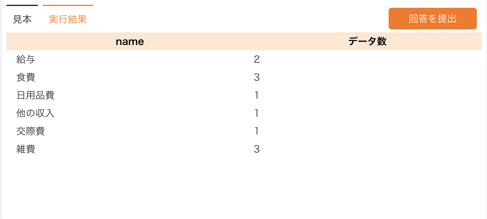
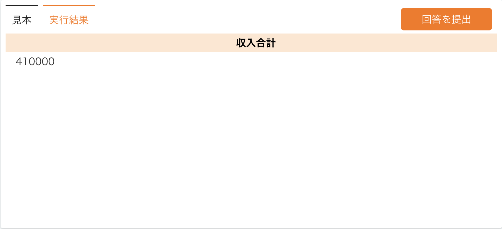

JOINとGROUP BY句  

【JOIN】  
JOIN文は複数のテーブルを結合する際に使用する。SELECT文と併用する際に利用する。  
基本構造  
SELECT 列1, 列2, ... FROM テーブル1  
JOIN テーブル2　on テーブル1.共通列 = テーブル2.共通列;  
例文）account_booksテーブルとcategoriesテーブルを共通列（category_id）で結合。SELECTを用いてこの表から入出金分類名と金額を取得します。 
```     
SELECT account_books.id, account_books.inout_date, categories.name, account_books.amount`  
FROM account_books
JOIN categories ON account_books.category_id = categories.id;  
```

【JOINの種類】  
・INNER JOIN：結合条件に一致する行だけを返す。  
　左右にテーブルを並べて比較した際、一致するIDをもつデータだけを結果に出力する  
・LEFT JOIN：左テーブルのすべてのデータと右テーブルの一致する行を返す  
　左右で比較した際、基準となる左のテーブルはすべて結果に出力するが、右の不一致のデータはnullを返す  
・RIGHT JOIN：LEFT JOINの逆  
・FULL JOIN：両方のテーブルのすべての行を返す。  
　一致していようがいまいが、両方のテーブルの全データを結果にだし、条件に合わないデータはnullを出力する。  

【GROUP BY】  
指定した列に基づいて、データをグループ化する。  
GROUP BY 列;  
例文）categoriesテーブルのname列をグループ化している。  
GROUP BY categories.name;  

【集計関数】データを集計する際に呼び出す関数  
・COUNT：指定した列の行数をカウントする  
　基本構造  
　SELECT COUNT(列) FROM テーブル名;  
例文）  categoriesテーブルのnameと、account_books.idの列名を数えた結果を抽出する。なお、idの結果はデータ数という列名に変更する。  
加えて、両テーブルをidの共通行で連結する。
```
SELECT categories.name, COUNT(account_books.id) AS 'データ数'
FROM account_books  
JOIN categories ON account_books.category_id = categories.id
GROUP BY categories.name;  
```  
  
・SUM：指定した列の数値を合計する。  
　基本構造  
　SELECT SUM(列) FROM テーブル名;  
例文）account_booksテーブルで収入の合計を計算する。その際amountは収入合計にリネームする。  
```  
SELECT SUM(amount) AS '収入合計'
FROM account_books
WHERE inout_type = 2;  
```  
  
