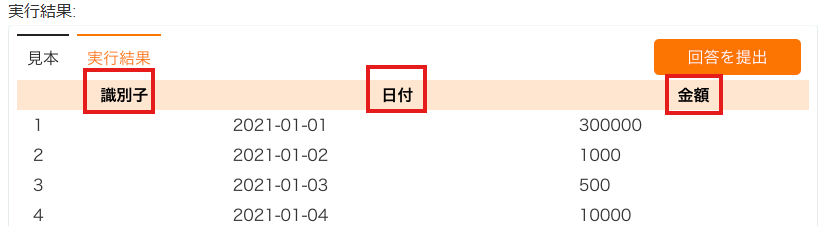

SQLの基本操作

【SELECT文を使った基本操作】  
テーブルからデータを抽出するには「SELECT」文を使用する。  
SELECT文の基本構造は以下の通りになっている。  

SELECT 列名1, 列名2, ...  
FROM テーブル名  
WHERE　条件  

SELECTで抽出する列を指定して、  
FROMはどのテーブルから抽出するかを定義する  
WHEREは抽出する条件を指定している。  

【WHEREについて深堀り。】  
例えば100以下のammountというデータを取得する場合は、  
WHERE ammount <= 100というように条件文を構成する。  
条件のでは、かつ「AND」、または「OR」を併用できる。  
否定したいときは「!」で否定できる。  

【他にも…】  
取得した列名を表示するときには「AS」を使用したり、  
SQLは柔軟に操作できる。  
`SELECT id AS 識別子, inout_date AS 日付, amount AS '金額'
FROM account_books`  
