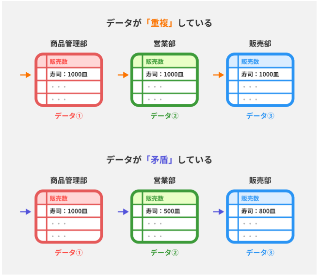
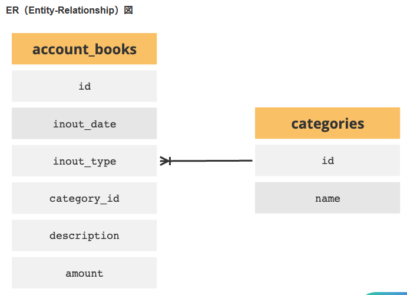
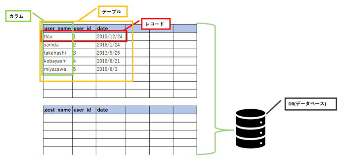

データベースとは

データベースとは、構造化された情報の集まり。
ようは、データを手軽に利用できるように規則正しく格納されている。  
Excelなどの表計算ソフトもデータ管理に利用されるが、  
データが重複したり、データに矛盾が有ったりする。  
  

【データベースの種類】  
通常はリレーショナルデータベース（RDB）が使用されているが、  
状況に応じて、NoSQLデータベースや分散データベース(サーバの役割.mdを参照)などを使用することもある。

【DBMS】  
データベースを管理するソフトのこと。  
データの保存や取得更新などを効率的に行う。  
[機能]  
・データの格納、検索、更新  
・トランザクション管理(同時に複数ユーザーがデータにアクセスしても整合性がとれるようにする)によってデータの重複や矛盾をなくす。  
・ロック機構(1ユーザーがアクセスしている間他ユーザーはアクセス不可)  
・バックアップ生成(データの安全を確保しデータを復元できるようにしておく)  
・制約を設定(不正なデータを排除できる)  
・権限管理ユーザーごとにアクセス権限を設定する。また、パスワードなどの認証を行う  
[主なDBMS]  
RDBMS(後述)  
NoSQLデータベース：非関係型のデータモデルを使用、分散処理などに優れている。(非関係型とは、行と列で定義されたDBではなくキーと値など柔軟な様式で定義されたDBのこと)

【リレーショナルデータベース(RDB)】とは  
Excelをイメージするとわかりやすい。  
行と列でデータが整理されている。  
それぞれのデータの集合をテーブルと呼ばれており、  
各テーブルにはキーが設定されている。 
このキーによって各テーブルを関連付けたりすることができる。  
下記画像ではidという共通のキーでテーブル同士が紐づいている。  
   
  

【ユニークとnull】  
●ユニーク  
データベース内で特定のカラムやカラムの組み合わせで重複がないようにするという意味。  
ユニーク制約をカラムに設定するとそのカラムに入力される値が他のレコードの値と重複しないよう制限させることができる。  
●null  
データが存在しないことを表す。数値の0やブランクではない点に注意。ユニーク制約がされたカラムでもnullの重複を許容するDBMSもある。  

【キーの概念】  
[主キー]  
テーブルのレコードの内、nullでもなく重複もしていない、レコードを特定するための値。  
[外部キー]  
別のテーブルの主キーを参照するためのカラム。  
これにより外部のテーブルと紐づけることができる。  

【RDBMS】  
このRDBを効率的に管理・操作するソフトをリレーショナルデータベースマネジメントシステム（RDBMS）という。  
代表的なものは、MySQL、PostgreSQL、OracleDBなどがある。  

【SQLと操作】  
SQLとはRDBMSでデータを操作するための言語。  
SQLは以下のように用途ごとに細分化される。  
・DDL：DBの構造やテーブルの構造を定義する  
・DML：データを操作する（削除したり、追加したり、更新したり）  
・DCL：データのアクセス権などを制御する。  

