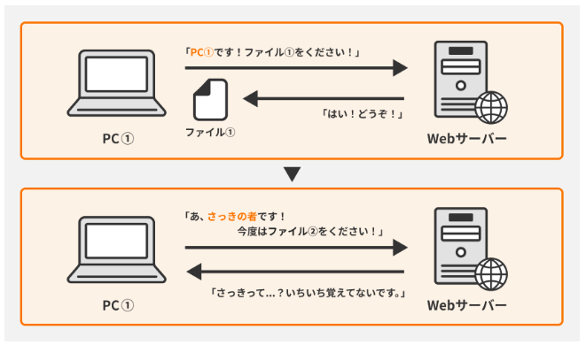
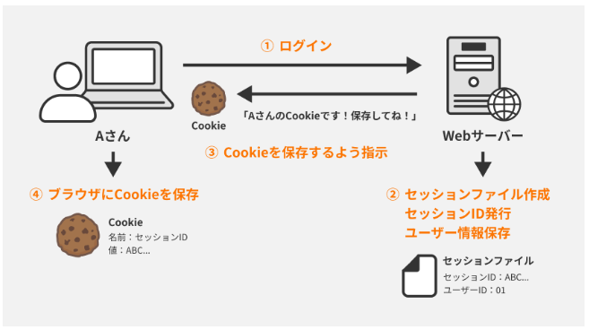

HTTPについて深堀

【HTTPとは】  
サーバーとクライアントが互いに情報をやり取りする際に用いられる通信プロトコル(規定)  
  
  
【HTTPリクエスト→】  
クライアントからサーバーへ送信される。  
リソースに対してのアクション(取得、投稿、更新、削除など)を要求する。  
構成  
HTTPメソッド：アクションの種類を表示する  
URI：要求するリソースの場所を指定する  
HTTPヘッダ：リクエストに関する追加情報を含んでいる。  
HTTPボディ(任意)：データ送信が必要なPOSTやPUTリクエストに含まれる。  
【HTTPレスポンス←】  
サーバーからクライアントへ送信される。  
リクエストの処理結果を伝える。  
構成  
ステータスライン：HTTPバージョン情報、ステータスコード、ステータスメッセージが含まれる  
HTTPヘッダ：レスポンスに関する追加情報を含む
HTTPボディ(任意)：リクエストされたリソースの内容や追加情報を含む  

【HTTPメソッド】  
GET：リソースの取得。サーバーにデータを変更せず情報を要求するだけの際に使用
POST：リソースの作成。サーバーにデータを送信して新しいリソースを作成させる際に使用。  
PUT：リソースの更新。指定されたURLのリソースを新しいデータで更新する際に使用。  
DELETE：リソースの削除。指定されたURLのリソースを削除  
HEAD：リソースのヘッダ情報。GETと同じくリソースを取得するが、ボディを返さず、ヘッダ情報のみを返す。  
OPTIONS：使用可能な通信オプションを調べる際に使用される。サーバーがどのHTTPメソッドをサポートしているかを確認するために使用される。  

【ステータスコード】  
リクエストに対してサーバーがどのように応答したかを示す数値。  
ステータスコードは1桁目を見ることで状況を推測できる。  
1xx(情報)：処理中のリクエストに関する情報を提供する。  
2xx(成功)：リクエストが正常に受付されたことを示す。  
3xx(リダイレクション)：リクエストを完了させるために追加のアクションが必要であることを示す。  
4xx(クライアントエラー)：リクエストに誤りがあるため処理できない。  
5xx(サーバーエラー)：サーバーがリクエストを処理できないことを示す。  

【ステートフルとステートレス】  
コンピューターがユーザーのセッション情報をどのように扱うかについての概念  
●ステートフル  
ステートフルなプロトコルやプログラムは過去のやり取りを記憶している。  
●ステートレス  
ステートレスなプロトコルやプログラムは過去の情報を保存せず独立したやりとりを行う。なのでリクエストは必要情報が都度必要になる。  
HTTPはステートレスなのでサーバーはクライアント情報を記憶していない。  
メリットとしては、各リクエストが独立しているので可溶性が上がり、またセッション情報を記憶する必要がないためサーバーの負担が減る。  
  

【アーキテクチャスタイル】  
Webサービスを設計する際に、システム全体の構造やデザインの中で、どのような部品を配置しそれらが相互にやり取りするのかを決定するための指針のこと。  
アーキテクチャスタイルを決めて置きそれに従って開発することで効率的なシステム構築が行える。  

【REST】  
HTTPを基にしたアーキテクチャスタイルの一つ。  
クライアント、サーバー間の情報交換を効率的に行える。  
HTTPはステートレスのため、リクエストの情報を持ち越すことはできない。  

【Cookie】  
Cookieはウェブサイトがユーザーのブラウザ側に保存する小さなデータの断片のこと。  
主な用途としてはセッション管理（ログイン情報、カートの内容、ゲームスコアなど）がある。  
また、トラッキングによりユーザーの興味を追跡してそれに合ったターゲティングを可能にする。  
クッキーはサーバー側がレスポンスを返す際にブラウザ側へと送信する。  
ユーザーが再びサイトを訪れた際にリクエストと同時にサーバー側へ渡す。  
Cookieには有効期限があり、期限を過ぎると自動で削除される。  

【セッション】  
サーバーがユーザーの状態や活動を一定期間記憶する技術。  
ステートレスなHTTPプロトコルでもユーザーの利便性を向上させることができる。  
サーバーはセッションIDを使用して、ユーザーを識別する。  
このIDはユーザーがサイトを訪れた際にサーバーで作成され、  
Cookieを通じてユーザーのブラウザ側で保存される。  
サーバー側でもIDと紐づいたユーザー情報が保持される。  
  

【HTTPS】  
HTTPSは情報を安全に送受信するためのプロトコル。  
ユーザー情報を暗号化し、それらの情報にアクセスする際に「鍵」の照合を行う。  

