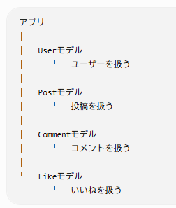

ORMとActiveRecord

ActiveRecordはオブジェクト指向プログラミングとリレーショナルDBの橋渡しをするRubyのORMライブラリ。  
SQLの知識がなくても直観的にDB操作ができる。  

ORMとはオブジェクトとDBレコードを対応させる仕組み。  
Rubyのオブジェクトを通じてデータの操作をすることができる。  

【ActiveRecordの使い方】  
SQL文が簡単な文言で代用できる。  
例）以下は同じ内容のDB操作  
[AcitiveRecord]  
`user = User.find(1)`  
[SQL]  
`SELECT * FROM users WHERE id = 1 LIMIT 1;`  

【ActiveRecordの主要機能】  
①マイグレーション(移行)機能：既存のDBに新たに項目を追加したり、バージョン管理も行えるので、過去のDBの状態の戻すことができる。  
②アソシエーション定義：モデル同士を関連付けることができる。  
モデルとはMVCモデルにおけるモデルであり、アプリ内ではデータの種類ごとにモデルが存在する。  
  
注意点  
一文で簡潔な処理に見えて、裏のSQLでは大量の文が生成されてしまい、パフォーマンスに影響が出る場合がある。  
対策としてincludesなどであらかじめ処理に使用するであろうデータをまとめおいておく。  
joinsでテーブルを結合して置き、テーブル間の移動を減らす  
また、バリデーションなどを設けることによって適切なデータを保存しデータの整合性を確保することも重要。  
