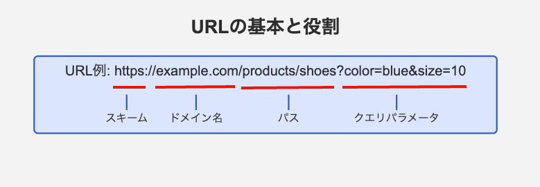

#URLとは

URLとは、Web上の情報にアクセスするための固有の識別子。  
URLを使用することで、情報にアクセスするためのリクエストを送信できる。  

【URLの基本構成】  
URLは以下の構成でなりたっている。  
| 構成要素 | 説明 |
|-----------|------|
| スキーム | URLの先頭で通信手段を指定する |
| ドメイン名 | 各Webサイトを識別するための名前 |
| パス | ドメイン名の後ろに続き、リソース(/index.html)の位置を示す |
| クエリパラメータ | URLの後ろに続き、追加情報や検索条件を指定する |  
  

【ローカルホストについて】  
`http://localhost`は自分自身のコンピュータ上で動作しているサーバーを示すドメイン名。  
開発やテスト環境でサーバーの動作確認を行う際に使用される。  
多くの場合特定のポート番号3000や8000、8080などと併せて利用され、  
外部からのアクセスを遮断した環境でWebサービスを試す際に用いられる。  
基本的にローカルホストのIPアドレスは127.0.0.1が割り振られる  
IPアドレスはコンピュータ同士が互いに識別し合うための名前のようなもの。  
【名前解決について。】  
ドメイン名（google.comやlocalhost）はインターネットの接続できる場合DNSサーバーに問い合わせて、IPアドレスを取得します。  
しかし、localhostではインターネットにアクセスできないので、代わりにPC内のhostsフォルダを参照してIPアドレスへの変換を行う。  
このようにドメイン名からDNSサーバーあるいはhostsにアクセスしてIPアドレスを取得することを名前解決という。
