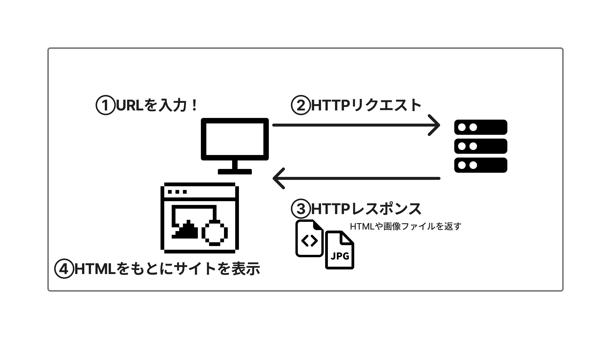

# Webサイトの仕組み

Webサイトが表示される仕組み

【Webサイトの基本】
URLを入力した際に、後ろ側では何が起こっているのか。
URLをクリックすると、クライアント（ユーザーのPC）側からWEBサーバーへとリクエストが送られる。
リクエストを受けとったサーバーはIPアドレスを辿り、DNSサーバーへリクエストをたらい回しにする。
必要なファイルをかき集め、レスポンスとしてクライアントへ返す。
レスポンスを受け取ったクライアントはHTMLやJPGを解析し、WEBサイトを出力する。
このような一連の動きを**クライアント・サーバーモデル**という

