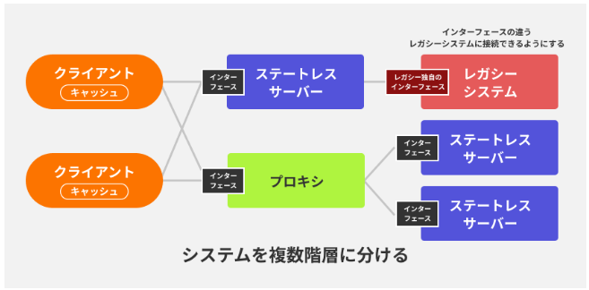

アーキテクチャスタイルとMVCモデル  

【アーキテクチャスタイル】  
Webサービスの設計の際に、システム全体の構造やデザインの中で、どのような部品を配置しそれらが相互にやり取りさせるのかを決定するための指針のこと。  
アーキテクチャスタイルを決めて置きそれに従って開発することで効率的なシステム構築が行える。  
代表的なアーキテクチャスタイル）3層アーキテクチャ、MVCモデル、RESTなど  

【3層アーキテクチャ】  
アプリケーションを3つの層に分けてそれぞれが役割を持つようにする。  
メリットとしては、コードの管理が容易になり、メンテナンス性が向上する。  
●プレゼンテーション層  
ユーザーとアプリケーションのインターフェースを提供する層  
HTML/CSS/JSなどが用いられる。  
●アプリケーション層  
ロジック処理をする層  
リクエストを受け取り、処理を行う。  
プレゼンテーション層とデータ層の仲介役  
●データ層  
データの保存と取得を行う層  
DBやファイルシステムとやり取りしてアプリケーション層に返すような役割  

【MVCモデル】  
基本的には表示部分と処理部分を分離させる2分割の様式。  
●Model  
ロジックの管理を行う  
●View  
データの表示を行いユーザーに見える部分を担当  
HTML/CSS/JS  
●Controller  
ModelとViewの橋渡し。ユーザーからの入力を処理してModelを操作してViewに結果を表示させる。  

【REST】  
分散システム設計に広く使用されるアーキテクチャスタイル  
クライアントとサーバー間のやりとりをスムーズに行う。  
HTTPのメソッド(GET,POST,PUT,DELETEなど)を用いるため、  
ステートレスな特徴である。  
ステートレスなため、キャッシュを使用してクライアント側で情報を保持させる。  
HTTPメソッドを使用するといった統一性があるため、  
操作に一貫性が生まれる。またこの統一性からサーバーを階層化して管理することも可能になる。  
  
このようなRESTの特徴に則って実装されたものは「RESTful」といわれる。  

【WebAPI】  
クライアントサーバーモデルに基づいてHTTPプロトコルを使用して実装したシステム。  
異なるソフトウエア間で情報交換するための仕組み。  

[主な特徴]  
●プラットフォームに依存しない：どのプログラミング言語やシステムでも利用可能  
●標準化された通信: HTTPリクエストを使用し、一般的にJSONまたはXML形式でデータを送受信します。  
●スケーラビリティ: 需要に応じて容易に拡張可能です。  
[具体的な動作]  
リクエストの送信: クライアント（Webアプリケーション、モバイルアプリなど）からAPIにHTTPリクエストを送信します。  
データの処理: APIはリクエストを受け取り、必要な操作を実行します（データベースのクエリ、計算など）。  
レスポンスの返信: 処理結果をクライアントにHTTPレスポンスとして返送します。  