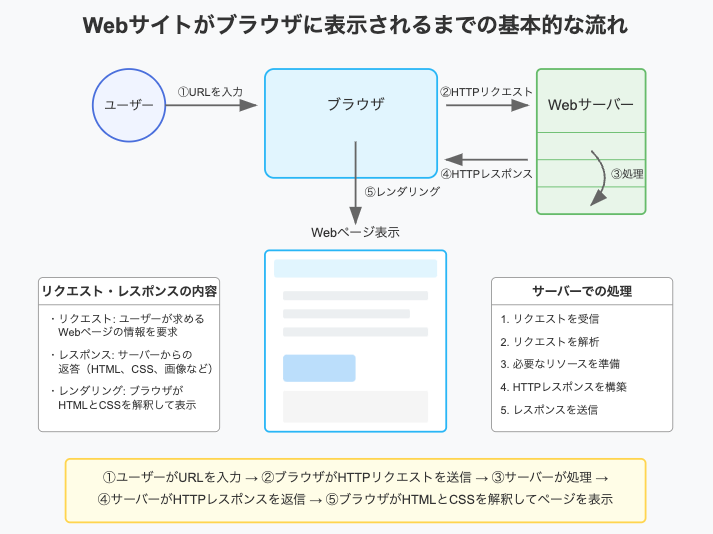

サーバーとは

サーバーはインターネット上で動作しているコンピュータ、またはソフトウエア。  
主な役割は、  
クライアントからリクエストを受け付ける。  
リソース(HTMLファイルや画像ファイル)を返却(レスポンス)する。  

Webサービスが利用できるようになるには、  
サーバーがインターネット上に存在し、かつ、サーバーにプログラムがアップロードされている必要がある。  

ローカル環境とサーバーの違い  
ローカルでは手元のPCがサーバーの役割を担ってくれている。しかし、インターネットから切り離されているため、外部の人間はその人のローカル環境を閲覧できない。  
もう一度サーバークライアントモデルを画像で確認。  
  

