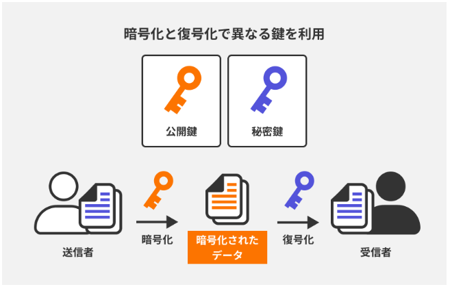
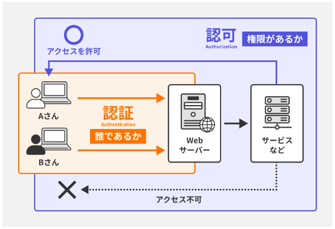

Webセキュリティ  

【情報セキュリティの3要素】  
機密性、完全性、可用性  
[機密性]  
情報が許可されたユーザーだけにアクセスできるようにする。  
機密性を高めるための方法。  
●暗号化：データを暗号化させる  
●アクセス制限：認証と許可により適切なユーザーだけが情報にアクセスできるようにする。  
●セキュリティポリシー：組織内で情報の扱いの取り決めを決めておく  
[完全性]  
情報が正確で改ざんされていないことを保証すること。  
●デジタル署名：データが正当な送信者から送られてきたことを証明し、改ざんされていないことを保証する。  
●監査ログ：システムのアクティビティを記録して不正操作があった場合追跡できるようにしておく  
[可用性]  
必要な時に情報にアクセスできることを保証する  
●バックアップ：データが損失したときに復旧しやすくする  
●冗長化：システムのスペアを用意しておき、障害時にもサービスを継続できるようにしておく  
●障害対策：不正アクセスやサイバー攻撃に対する対策を講じておく  

【代表的な攻撃と対策】  
[ブルートフォース(総当たり攻撃)]  
パスワードのすべての組み合わせを試し、正しいパスワードを見つけること。  
[対策]  
●複雑なパスワードを使用  
●パスワードをミスするとアカウントをロックする  
●二段階認証などを設ける  
●ログイン行為に回数制限を設ける  

[SQLインジェクション]  
不正なSQLコードをフォーム内に入力してDBの中身を操作すること  
[対策]  
●SQL文を生成する際にユーザーからの入力された文字列を変換する。  
●ORMを使用する。(ORMはDBのテーブルとプログラムのオブジェクトを対応させることで、SQLを直接書かずにDBを操作できる仕組み)  

[クロスサイトスクリプティング(XSS)]  
不正なスクリプトをWebページに埋め込み、ユーザーのブラウザで実行させる。これによりセッション情報やCookieを盗む  
[対策]  
●ユーザーからの入力された文字列を変換させる  
●セキュリティポリシーを設けておく  

[クロスサイトリクエストフォージェリー(CSRF)]  
ユーザーに対して意図しないリクエストを送信させる方法  
ユーザーの権限を利用して不正な操作を行う。  
[対策]  
リクエストごとに固有のトークンを使用して正当なリクエストか検証させる。  
(トークンはサーバーが発行するランダムな文字列のこと。レスポンスの際にユーザー側にも共有し、サーバーとユーザーで合言葉のように使用する。)  

[セッションハイジャック]  
ユーザーのセッションIDを盗み、セッションを乗っ取る攻撃  
ユーザーになりすまし、操作を行おうとする  
[対策]  
●HTTPSを使用する  
●セッションに時間制限を設けてタイムアウトさせる。  

【おもなセキュリティ対策】  
[入力の検証とサニタイズ]  
前提としてユーザーの入力は信頼できないものとして、  
入力された情報を一つずつ検証する。  
サニタイズは入力された文字列を正当な文字に変換させたり、除去するプロセスのこと。  
[セキュリティトークンの使用]  
一度だけ使用できるパスワードのようなもので、これの照合を行いサーバーとクライアントで安全にやり取りできるようにする。  
トークンは暗号化され、読み取られないようされる。  
[HTTPS]  
データ通信を暗号化するためのプロトコルのこと。  

【データ保護とアクセス管理】  
[暗号化]  
データを暗号化させ、適切な鍵持たない者には理解できないようにする。  
[非対称暗号化]  
公開鍵、秘密鍵の二つを使用して暗号化させる方式  
公開鍵は誰でもアクセスできる鍵で、秘密鍵は厳重に管理された鍵。  
データの送信者は公開されている受信者の公開鍵を使用してデータを暗号化させる。  
受信者は暗号化されたデータを秘密鍵を使用して解除する。  
  
補足）公開鍵証明書  
公開鍵とその所有者の身元を確認するデジタル証明書で、公開鍵の信頼性を高める。  
[認証]  
ユーザーやシステムの身元を確認するプロセスのこと。  
主に公開鍵証明書が使用される。  
これにより相手が信頼できる者だと保証できる。  
[認可]  
認証されたユーザーがリソースを操作する権限があるかを確認するプロセス。  
主にアクセス制御リスト(ACL)やロールベースのアクセス制御(RBAC)などによって行われる。  
●RBAC：ユーザーに権限を直接与えるのではなく、ユーザーには役割(ロール)を割り振り、そのロールに権限を与える。  
ロールの持つ権限の範囲内の操作ができる。  
このように認証と認可を通過してリソースを操作できる。  
  

