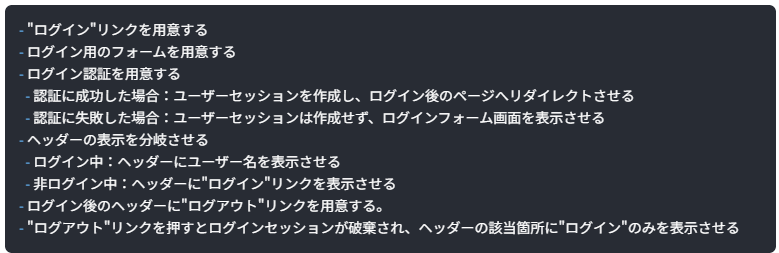
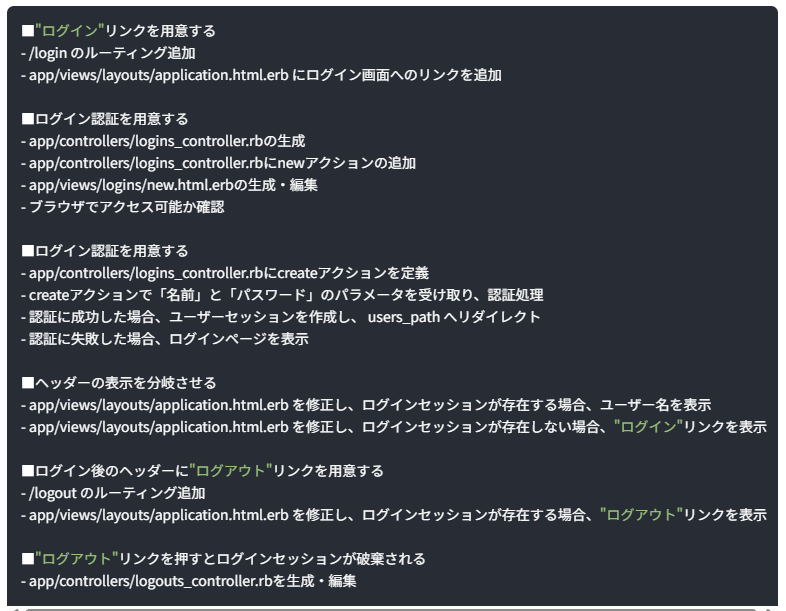

ログイン機能の実装  

ログイン機能の実装手順  
ログインには基本的にメアドやパスワード、ユーザー名を使用する。  
実装ではどこから始めるかわかりにくいため、  
ログイン処理のステップを確認しながら進める。  
①サービスにアクセス  
②ログイン画面へ移動  
③ログイン情報を入力  
④サーバー側で認証（入力情報がサーバーに送られ、認証処理が行われる）  
⑤認証成功（セッション作成・ログインページへリダイレクト）  
⑥ログイン後の状態（利用可能なサービスや情報が表示される）  
⑤認証失敗（ログインページに戻り、エラーメッセージが出力）  
⑦ログアウト処理（ログアウトを押すとセッション破棄し、閲覧制限がある状態に戻る）  

上記の内容を大雑把に要件定義する。  
下記画像になる。  
  

これをさらに詳細な仕様に落とし込む  
  

●ログインリンクを用意する。  
cofig内のルーティングファイルを編集し、  
リンクを踏んだ時のルーティングを設定する。  
次に画面にログインへのリンクを追加するので、  
Viewを編集する。  
viewにはlink_toヘルパーメソッドを使用して簡単にリンクを作成できる。  
リンク先についてはルーティングで定義されたnew_login_pathが使用される。  
ここでviewとルーティングが紐づく

●ログイン認証を用意する  
始めにログイン用のコントローラを用意する(コントローラの階層にコントローラファイルを新規で作る。)  
コントローラファイルにnewアクションを追加する。  
ルーティングでのnewアクションと対応するコントローラを定義する意味  
これによりルーティングとコントローラが紐づく  
次に画面にユーザー情報を入力するフォームを作る。  
htmlファイル(正確にはRailsのファイル)を生成して、各要素を記述していく  

●ログイン認証（ログイン実行処理）を用意する。  
先ほど生成したログイン用のコントローラファイルに、  
画面で入力した情報とDBに保存されている内容を照合させて、  
ログインの可否を行う処理を追記する。  
これによりDBとコントローラで紐づけが行われる。  
またログインによりセッションIDをブラウザに保存させる

●ヘッダーの表示を分岐させる  
ログイン認証のセッションにより、ユーザー情報を利用できるようになったので、画面上(View)にもユーザー情報を出力する。  
その前にユーザー情報に簡単にアクセスできるように、  
コントローラ側でユーザー情報を取得するメソッドを定義して、  
それをビューでも使用できるようにヘルパーメソッドとして登録する。  
